# Azure
## 가상 머신 생성하기
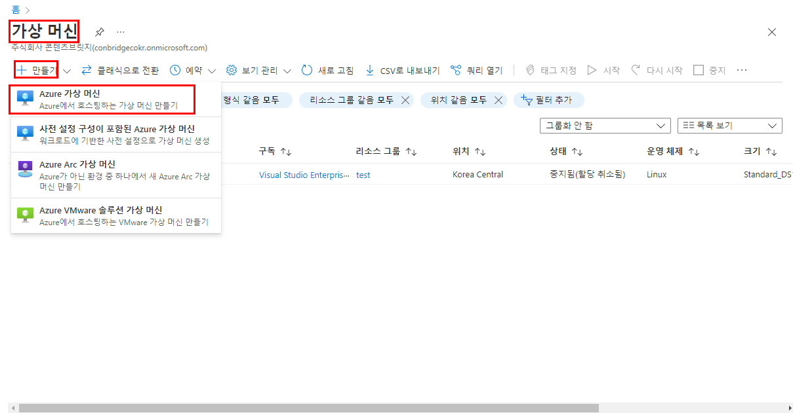 
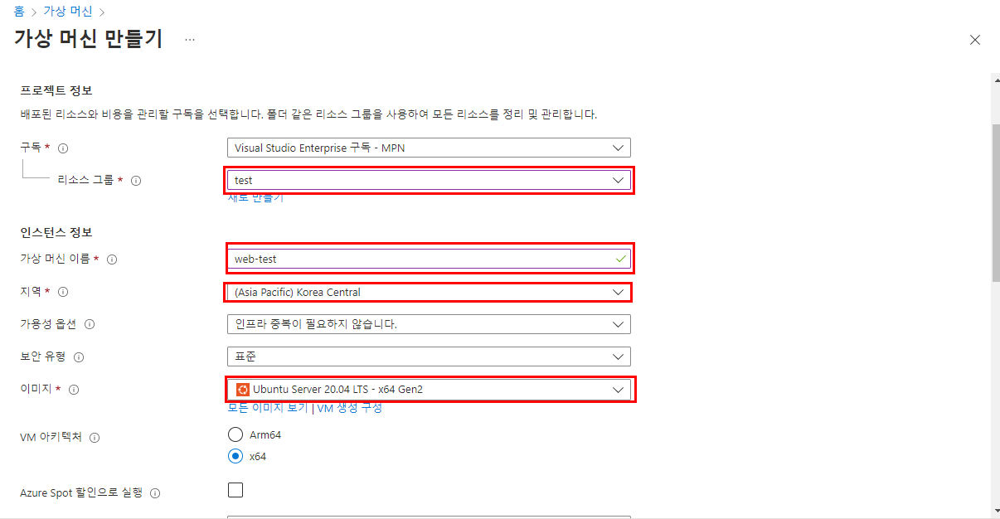 
리소스 그룹이 없으면 새로 만들어 준다. 
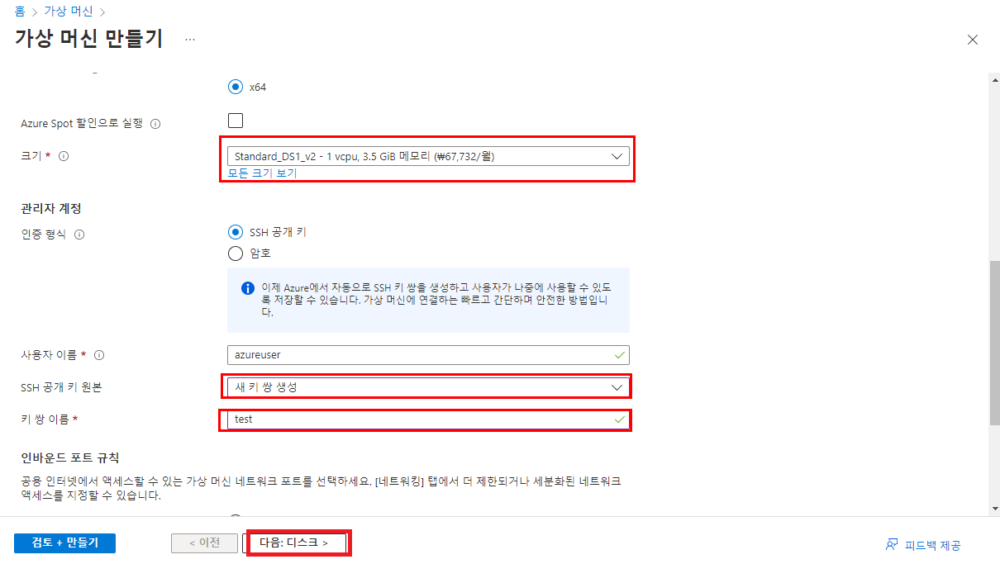 
크기는 자신이 원하는 크기로 설정한다. 
공개키 이름도 자신이 원하는 이름으로 설정한다. 다음 생성 부터는 미리 만들어둔 공개키를 가져와 쓸 수 있다. 

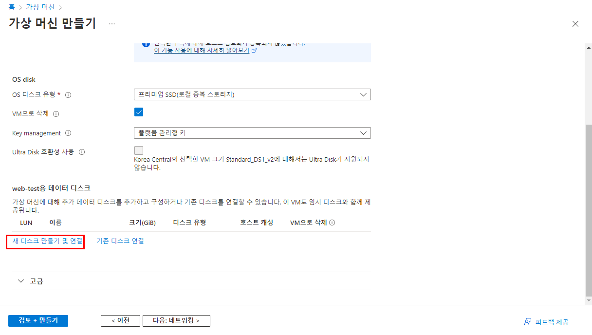 
새로운 디스크를 만든다. 이 디스크는 가상 머신 삭제해도 남겨서 다른 가상 머신에 연결 할 수 있다. 생성이 끝나고 연결했으면 네트워킹으로 넘어간다. 
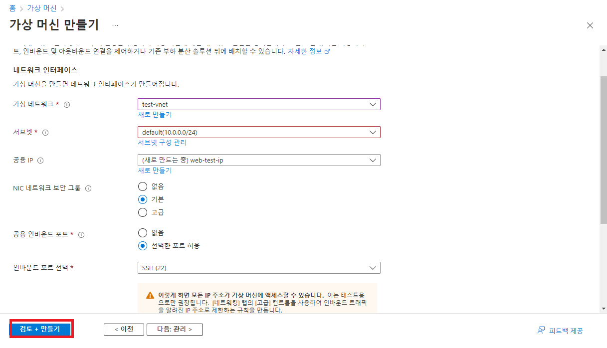 
네트워크에서는 특별히 설정할 부분은 없고, 공용 IP와 인바운드 포트 설정이 됐는지 확인 후 가상 머신을 생성해준다. 여기서 나오는 공개키 `.pem` 파일은 내 컴퓨터에 안전하게 보관해준다. 

## 가상 머신 접속하기
### PEM 파일 변환
가상 머신을 생성했다면 다음과 같은 `.PEM` 파일이 있을 것이다. 아걸 `.PPK` 파일로 변환해 PUTTY를 통해 가상 머신해 접속할 예정이다. 
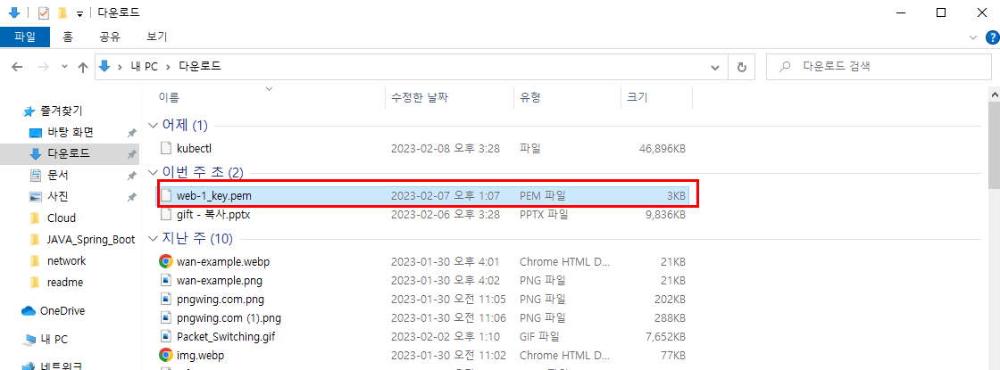 
`PUTTY`를 설치하면 나오는 변환 프로그램인 `PUTTYGEN`을 실행시킨다. 
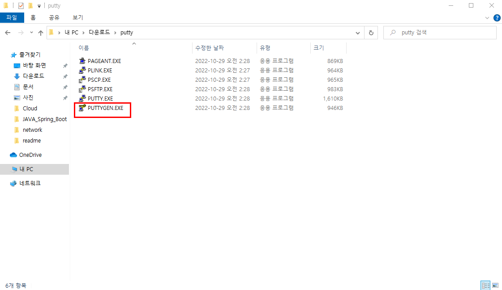 
`.PEM`파일을 import 해준다. 
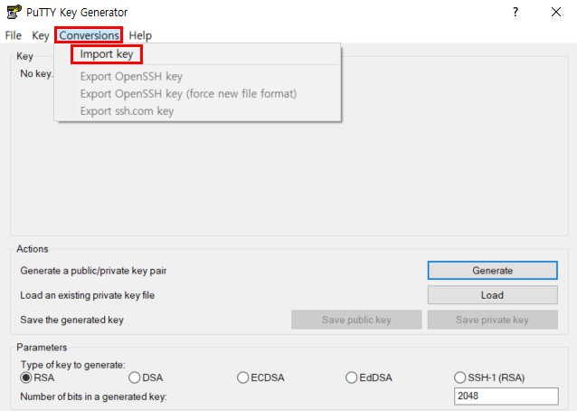 
`Save private key`를 눌러 `.PPK` 파일로 변환해준다. 
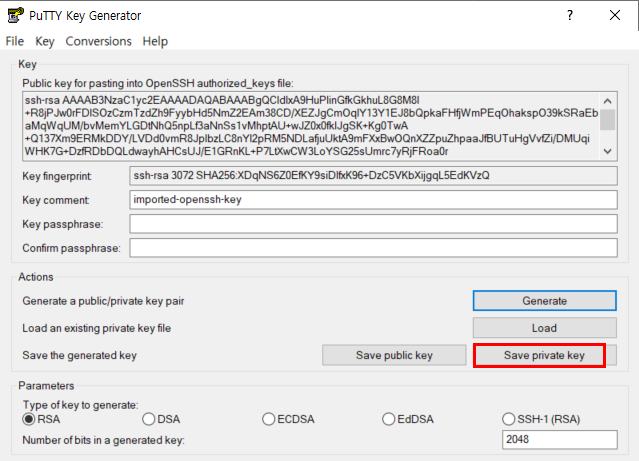 

### PUTTY로 원격 접속하기
`PUTTY` 프로그램을 실행한다. 
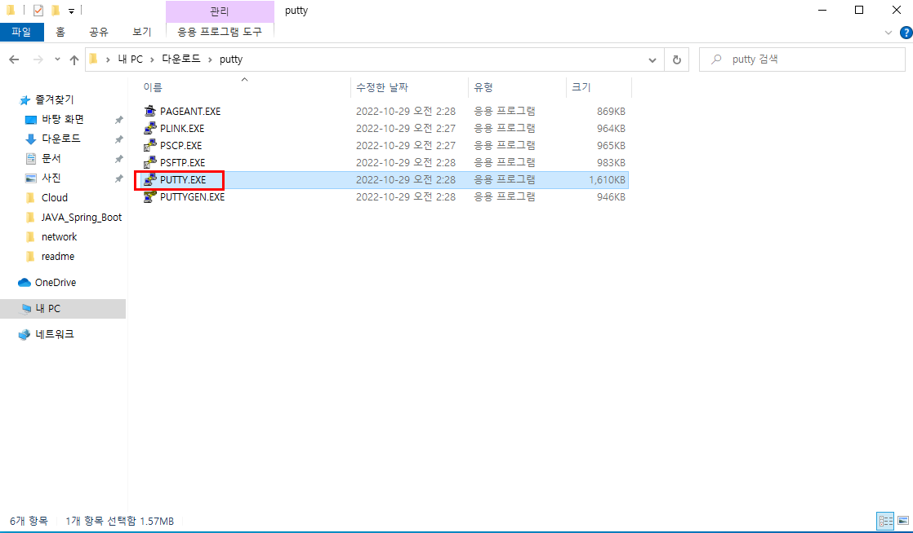 
접속할 가상머신의 공용 IP 주소를 복사한다. 
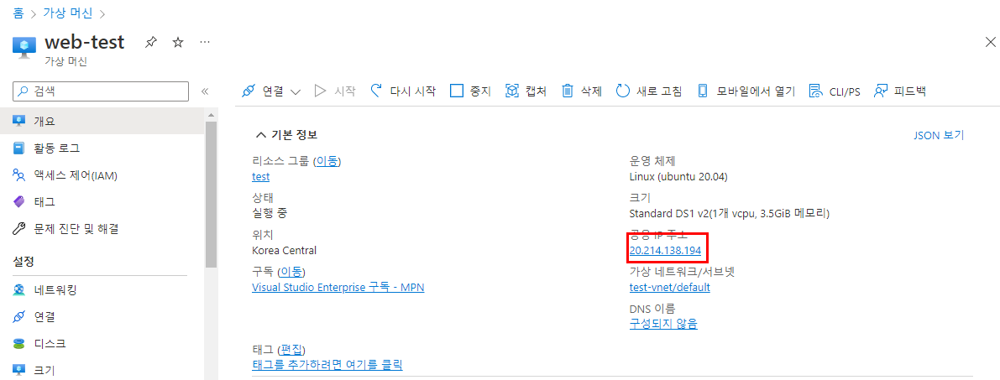 
다음 칸에 `azureuser@공용 IP`를 입력한다.
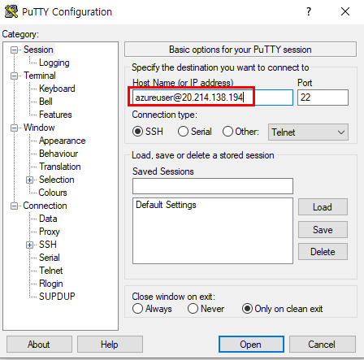 
다음 경로로 들어가 `Private key file for authentication`에 방금만든 `.PPK`파일을 적용시킨 다음 `OPEN`을 눌러 접속시도를 한다. 
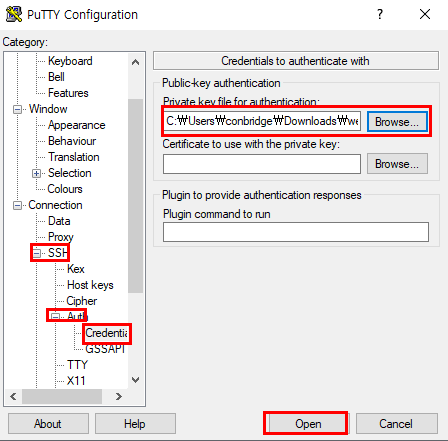 
성공하면 다음과 같은 화면이 뜬다. 
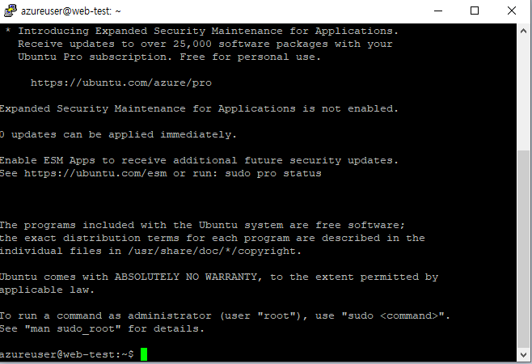 